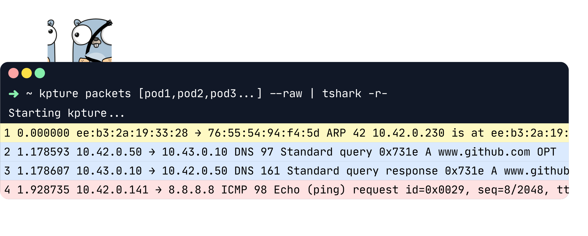

# Kpture

[](https://codeclimate.com/github/gmtstephane/kpture/maintainability)
[](https://codeclimate.com/github/gmtstephane/kpture/test_coverage) 


[](https://goreportcard.com/report/github.com/gmtstephane/kpture)

## Description
Kpture is a simple tool that allows you to capture packets from remote pods in your cluster using ephemeral debug containers injection.




## Installation

### With **golang** :
  
```bash
go install --tags=cli github.com/gmtstephane/kpture@latest
```

### With **homebrew** :
  
```bash
brew install gmtstephane/kpture/kpture
```
### With **prebuilt binaries**
You can find the latest binaries for your platform on the [releases page](http://www.github.com/gmtstephane/kpture/releases).

### Prerequisites
- A kubernetes cluster version 1.23 or higher

## Capturing packets
#### Start kpture in separated pcap files
```bash
kpture packets nginx-679f748897-vmc5r nginx-6fdt248897-380f4  -o output
```
This will create the following output directory: 
```bash 
output
├── nginx-679f748897-vmc5r.pcap
└── nginx-6fdt248897-380f4.pcap
```
#### Start kpture and pipe the output to **tshark**
```bash
kpture packets nginx-679f748897-vmc5r nginx-6fdt248897-380f4  --raw | tshark -r -
```
#### Start kpture all pods in current namespace to ./output and pipe the output to **wireshark** at the same time
```bash
kpture packets --all -o output --raw | wireshark -k -i -
```

### Roadmap
Here are some features I plan to add to kpture in the near future:

- Documentation: I plan to add more documentation to the project, including a more detailed description of the project.
- Multi-container interface capture support (multus): Currently, kpture only captures packets from the primary container of a pod. I plan to add support for capturing packets from multiple interfaces.
- Filter per pod: I plan to add the ability to apply filters to capture only specific packets from a particular pod, based on criteria such as protocol, source/destination IP address, and port numbers. At the moment, a global filter can be applied to all pods using the --filter option.
- Capture template by YAML config file: I plan to add support for configuring kpture using YAML config files, allowing users to specify and filter the pods to capture, filters to apply, and output format. This will make it easier to manage and reproduce captures with.


### Alternative tools

- [kubeshark](https://github.com/kubeshark/kubeshark) is a powerfull tool to debug network issues in your cluster. It is a great tool if you want to debug network issues in your cluster. However, it requires a lot of configuration and is not as easy to use as kpture. It also requires a lot of resources to run. Yet kpture is more simple and lightweight. It handle only the capture part and let you use your favorite tools to analyze the captured packets. Wireshark can anaylse and parse most protocols where kubesark cannot. Kpture is also infrastructure agnostic and does not needs any specific configuration to run.

- [ksniff](https://github.com/eldadru/ksniff) ksniff is a simple tool that allow you to capture traffic from a given pod. It is a great tool if you want to capture packets from a single pod. However, it does not allow you to capture packets from multiple pods at the same time. It retreives the packet stream trought the pod standard output where kpture uses gRPC streams to retrieves packet.

### Options

```
  -a, --all             Capture from all pods in the selected namespace
  -h, --help            help for packets
  -o, --output string   output folder
  -r, --raw             Print raw packet to stdout (for tshark/wireshark)
  -s, --split           split pcap files per pod (default true)
```

## Auto completion

You can enable auto completion (pods and options) for bash and zsh by running the following command:

```bash
kpture completion bash > /etc/bash_completion.d/kpture
```

```bash
kpture completion zsh > /usr/local/share/zsh/site-functions/_kpture
```