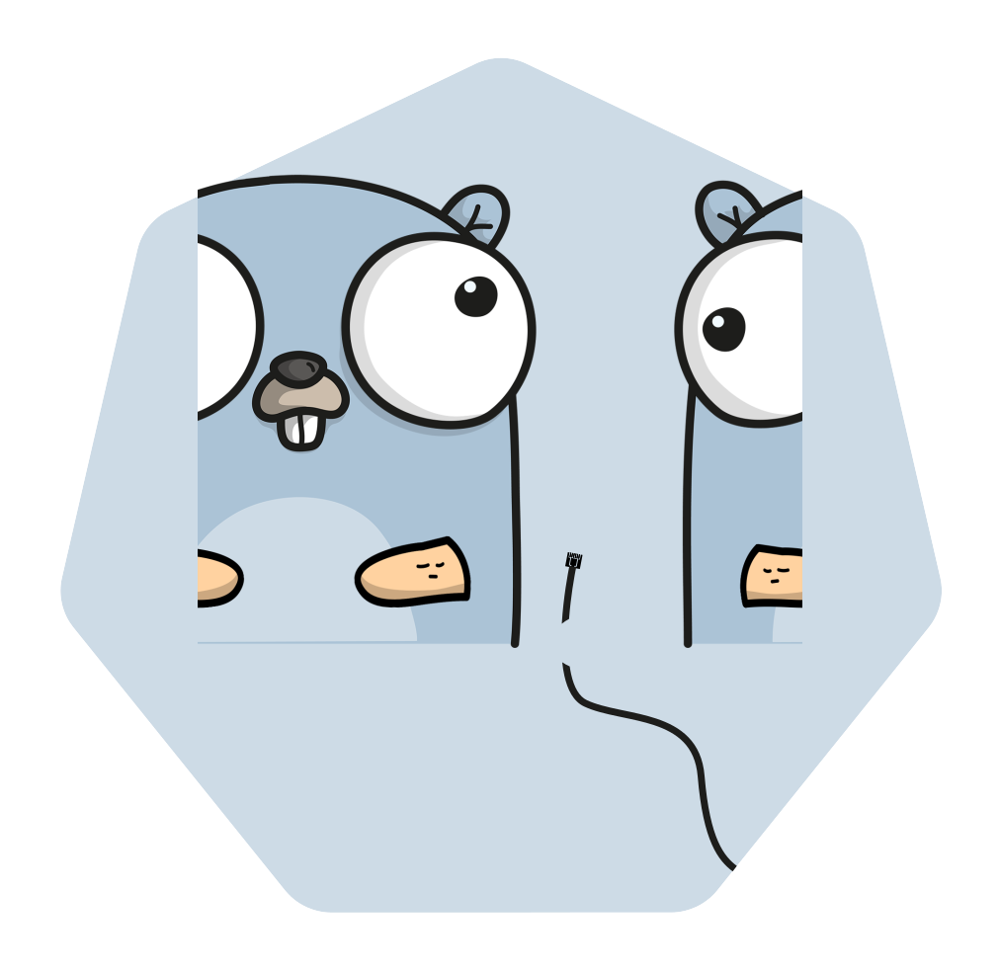
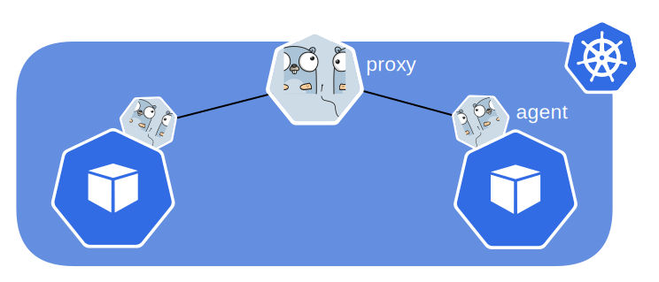
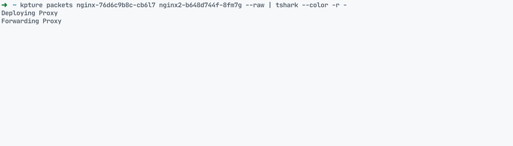

# Kpture

[](https://codeclimate.com/github/gmtstephane/kpture/maintainability)
[](https://codeclimate.com/github/gmtstephane/kpture/test_coverage) 


[](https://goreportcard.com/report/github.com/gmtstephane/kpture)

## Description
Kpture is a simple tool that allows you to capture packets and logs from remote pods in your cluster using ephemeral debug containers injection.




## Installation
### Using Go

```bash
go install --tags=cli  github.com/gmtstephane/kpture
```

### Using pre-built binaries 
Download the latest release from the [release page](https://github.com/gmtstephane/kpture/releases/)


## Getting started
### Capture packets from a pod
kpture uses you kubectl context to connect to your cluster. You can specify the namespace and pod name to capture packets from.

```bash
kpture packets -p my-pod
```


##

